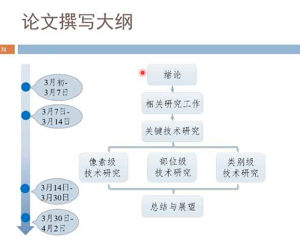

# blood-vessel-daily
<!-- overleaf https://www.overleaf.com/project/62208087dede1e19950d3295  -->

## 3.28
第二章顺一遍

## 3.27
写完连接，把第二章对一遍

## 3.26
录自我介绍视频，投完工行  
写追踪和连接（一天写完！！！！）

## 3.25  
分割指标+追踪开头（能写多少写多少）  
投简历（工行+邮储信用卡中心合肥）

3.12-3.15 绪论  
3.15-3.20 相关技术研究  
2022/03/18  血管分割深度学习方法写完，开始写追踪  

## 2022/03/15
开始写绪论和分割相关工作

## 2022/03/14
1、继续整理  看别人怎么写 断裂连接的 难点

## 2022/03/13
**1、---------各类血管的分割精度 （bitahub在更新，暂时不能用）---------**  
2、整理文献，看别人怎么写 断裂连接的 难点   

## 2022/03/12
1、看前端视频一集，做完练习  

## 2022/03/11  
看一集前端视频  

时间安排？**其他同学的安排**：
  
**我的安排**：  
3.12-3.15 绪论  
3.15-3.20 相关技术研究  
3.20-3.25 技术方法  
3.25-3.30 结果总结  

## 2022/03/08
1、给老师看中期报告  
2、做中期PPT  
3、晚上9点AI面试  
4、尽量看一篇paper

## 2022/03/07
1、修改中期报告  

## 2022/03/06
1、阅读paper，做笔记 21-Topology-Aware Retinal Artery–Vein Classification via Deep Vascular Connectivity Prediction  
2、晚上修改中期报告

## 2022/03/05
1、上午整理开题参考文献，见文件夹“开题”（correction 只有三篇23、24、25）；建立github仓库；  
2、下午仓库配置lfs（没配置好），上传阅读笔记；  
3、仔细阅读23、24、25的correction部分，方法+指标+结果，做笔记；

