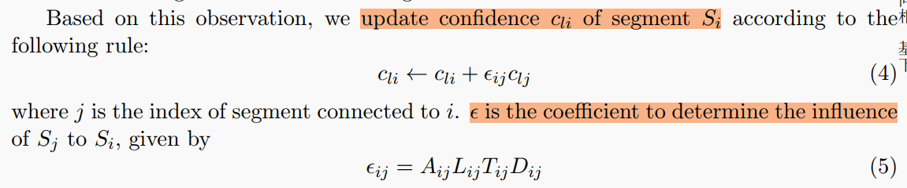
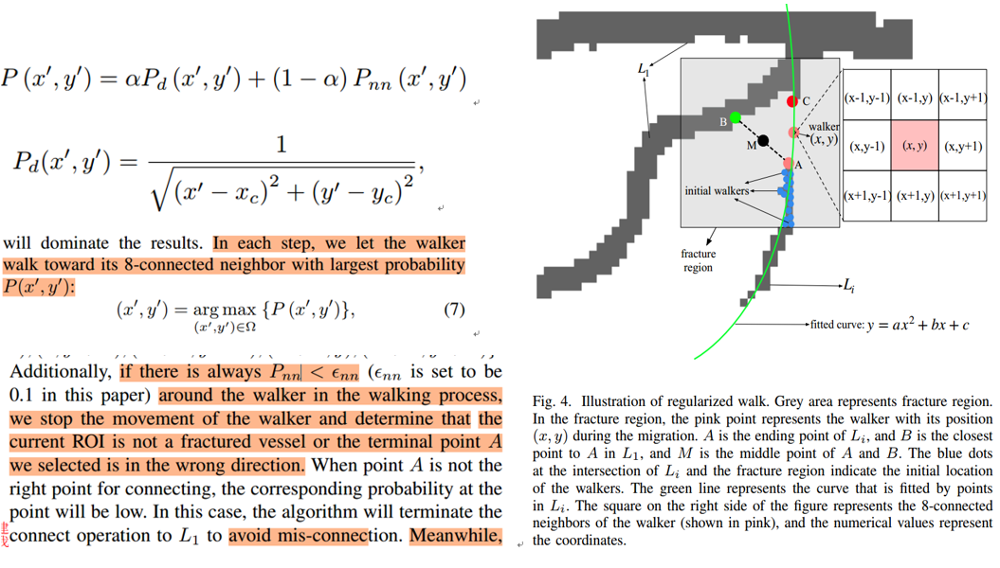
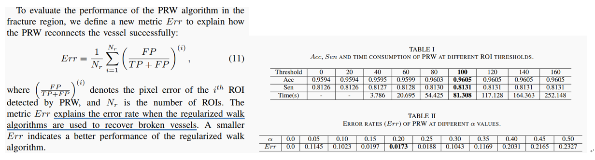
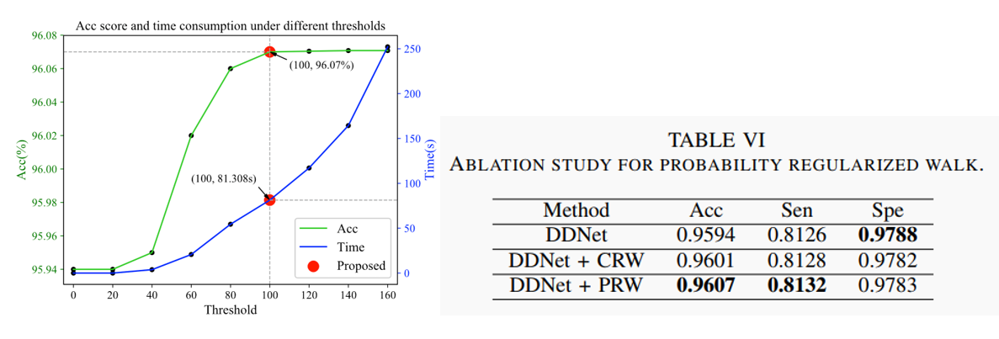
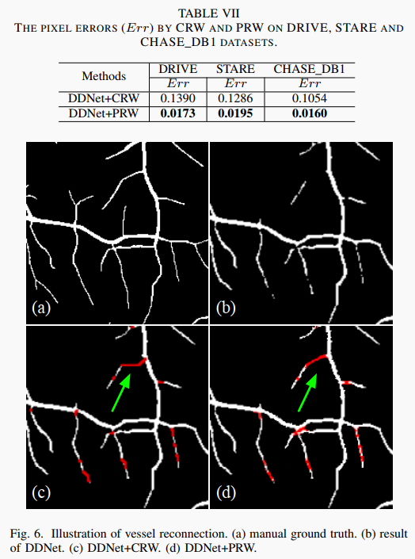

## 1、Joint Learning of Vessel Segmentation and Artery/Vein Classification with Post-processing 
**任务**：视网膜血管分割 和 动静脉判别

**方法**：

上文已经做了分割，且计算了每个像素的动静脉分类概率值。

实验发现分类结果中常出现两种错误，  
1、血管中间。这是由分割网络所致  
2、在cross points和branch points附近。  
这两种情况分别用intra label修正和inter prediction修正。

*段内：intra segment label propagation方法：*  
1、骨架细化，检测关键点（交叉点和端点），相邻关键点之间的片段称为一个segment  
2、每个segments的类别用其中每个像素的（动脉概率-静脉概率）求和，用这个结果判别该片段属于动静脉的概率。

*分叉点：Inter-segment Prediction Propagation方法：*
通常在分类概率值低的地方容易出现分类错误，这些错误可以通过相邻的高置信度的影响来纠正。当形状、方向、位置相似时，有很高概率他们属于同一根血管，此时他们互相的影响应该很强烈。

基于这种观察，设置了如下的概率传播规则。

其中A、L、T、D是四个参数，分别表示归一化的：  
A：两血管相对方向  
L：连线和其中一个血管的相对方向  
T：平均粗细相似度，越接近T越靠近1  
D：两个点的距离反比

**评价指标**：
    没有针对拓扑结构设计指标，只评价了分割结果和动静脉分类结果。

## 2、19-Dense Dilated Network with Probability Regularized Walk for Vessel Detection 
这篇文章既有分割也有连接，可以借鉴一些写法。
骨架修正的相关工作只列了三篇【57】【58】【59】

**目标**：视网膜血管分割

**方法**   
CNN分割得到概率图和二值图后，为了连接断裂，模拟随机游走的过程（不是使用随机游走算法）。  
1、先将二值图的连通域标号，最大的连通域记为i1。分别计算其他连通域与i1距离<L的点A、B。记AB中点M，以M为中心的方行区域为连接断裂的ROI（fracture region）。  
2、确定方向。以小连通域的点集合拟合二次曲线，与i1的交点为C，  
3、以ROI内的小连通域的点为初始种子点，计算当前种子点的八邻域的概率值（与C距离的反比、当前位置分割概率值 二者加权求和（权值为0.2和0.8效果最好）），取最大概率值的邻域像素点为next step。  
4、直到8邻域内的点的概率值都很小，终止。  

**指标**：
1、选择距离阈值L：几个分割指标 Sensitivity (Sen) and Accuracy (Acc)、time consumption (Time)   
2、连接的评价指标：连接后的 1-precision（越小越好）。选择超参α也是通过这个指标。  
3、ablation study中和CRW（conventional walk (CRW)）连接方法做比较。

**表达**：
连通性：connectivity；
血管碎片：fracture of the vessels；
新生血管疾病：neovascular diseases；

## 3、13-TRANS An Automatic Graph-Based Approach for Artery/Vein Classification in Retinal Images 
方法较简单，定义了多种错误类别。见阅读笔记1.  
**拓扑指标**：提到accuracy-centerline pixels，应该是中心线上的正确率，没有细说。
